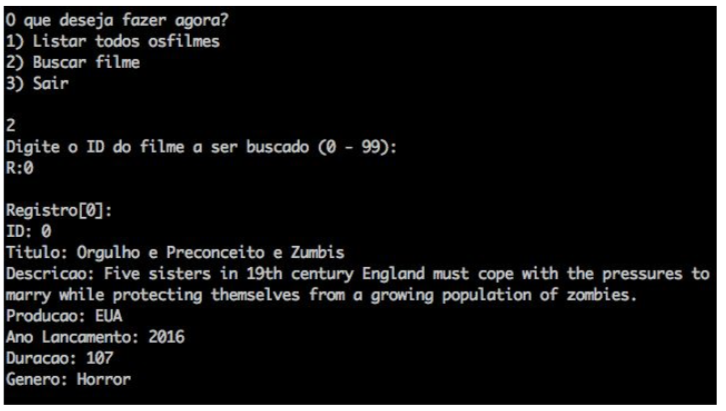

# Movies File Struct

OVERVIEW
--------------------------------------------------
The purpose of this project was to implement an application in C language that can Add, Remove and Search within a Database for the [File Structure Organization] course. It was made at the Computer Science undergraduate program from University of São Paulo (ICMC - USP).

PROJECT
--------------------------------------------------
Basically there is a Tweet database with the following file organization strucutre:
* fixed-length and variable-length fields with delimiters (in bytes)
* variable-register size with delimiters (in bytes)

You can List and Search movies within the database.


MOVIE FILE STRUCTURE
--------------------------------------------------
```bash
ID (Movie identification number - int)
YEAR (Release Year - int)
DURATION (Movie duration - int)
TITLE (Movie title - char*)
DESCRIPTION (Movie description - char*)
COUNTRY (Country - char*)
GENRE (Movie genre - char*)

```

Inside the database, the movies will be saved in a Binary file called `DADOS.bin` as the example below:

20198580Labyrinth|A movie about goblins|USA|Fantasy|#

[id][year][duration][name][description][production][genre]

EXAMPLE 
--------------------------------------------------


HOW TO COMPILE
--------------------------------------------------
Just use the makefile:

```bash
	make
	make run
```

MORE INFO
--------------------------------------------------
* Please check the file  `project report.pdf` to view the code and know more about this project.
